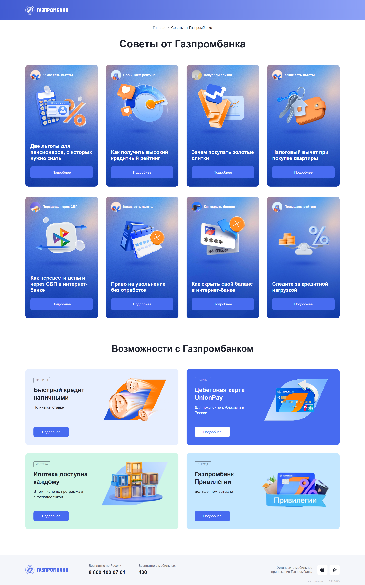
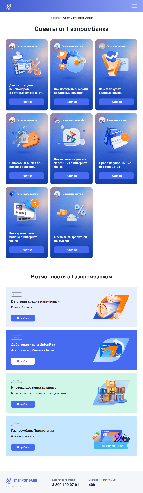
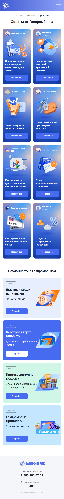
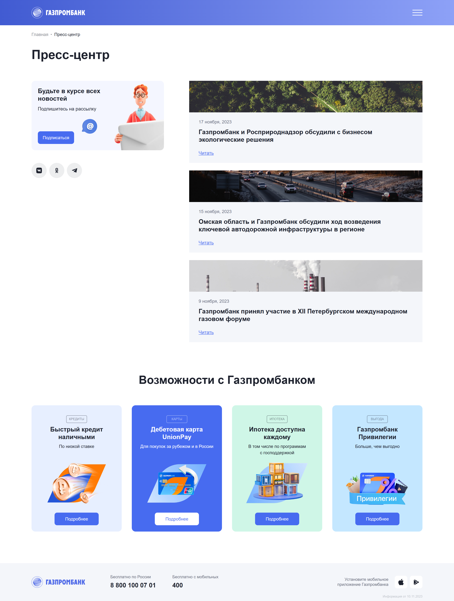
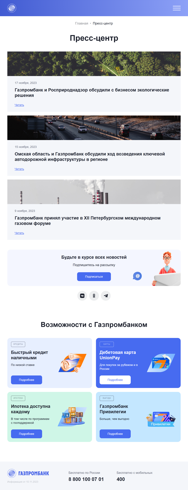
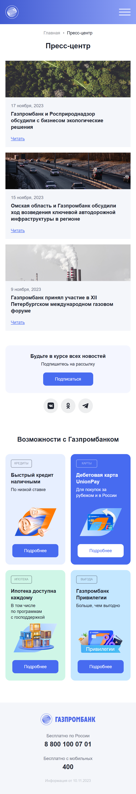

# Gazprombank-Adaptive-Layout
Адаптивная вёрстка страниц «Советы от Газпромбанка» и «Пресс‑центр»

# Содержание

1. [О проекте](#project)
2. [Страницы проекта](#pages)
3. [Запуск проекта](#start-project)

## <a name="project">О проекте</a>

В рамках проекта выполнена адаптивная вёрстка следующих страниц:
* «Советы от Газпромбанка» (`advices.html`);
* «Пресс‑центр» (`press-room.html`).

Проект выполнен для демонстрации навыков в портфолио: адаптивная вёрстка по макету Figma (Pixel Perfect), SCSS + БЭМ, Flexbox/Grid, оптимизация графики, соответствие стандартам доступности.

## <a name="pages">Страницы проекта</a>

### Страница "Советы от Газпромбанка"

#### Десктопная версия

#### Планшетная версия

#### Мобильная версия

### Страница "Пресс-центр"

#### Десктопная версия

#### Планшетная версия

#### Мобильная версия

## <a name="start-project">Запуск проекта</a>

1. На странице репозитория нажмите кнопку `Code` (зелёная кнопка вверху справа).
2. В выпадающем меню выберите `Download ZIP`.
3. Распакуйте архив в удобное для вас место на компьютере.
4. Установите приложение **Visual Studio Code**.
5. Установите расширение **Live Server** для VS Code.
6. Откройте папку проекта в VS Code.
7. Кликните правой кнопкой мыши по файлу `advices.html` или `press-room.html` и выберите **Open with Live Server**.
8. Браузер откроется автоматически по адресу `http://127.0.0.1:5500/` (или аналогичному).